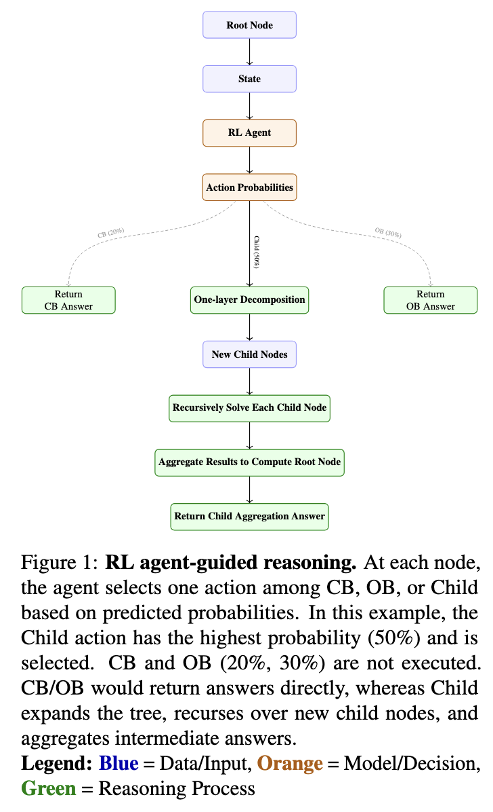

# From Roots to Rewards: Dynamic Tree Reasoning with RL (Dynamic ProbTree)
Source code and experiments for our enhanced Probabilistic Tree-of-Thought (ProbTree) framework, which introduces dynamic reinforcement learning for adaptive and efficient tree-structured reasoning on knowledge-intensive complex questions.

This work builds upon the original "Probabilistic Tree-of-Thought Reasoning (ProbTree) framework by Cao et al. (EMNLP 2023)", extending it with a dynamic RL-based approach that incrementally constructs and optimizes the reasoning tree for better accuracy and computational efficiency.

Source code and results correspond to our paper "From Roots to Rewards: Dynamic Tree Reasoning with RL".

[](https://github.com/ahmedehabb/From-Roots-to-Rewards-Dynamic-Tree-Reasoning-with-RL/issues)
[](https://opensource.org/licenses/Apache-2.0)
[](https://www.python.org/)
<!-- https://img.shields.io/badge/arXiv-122134.5678-b31b1b.svg how you add arxiv link -->
<!-- [](https://arxiv.org/pdf/2311.13982.pdf) -->

> Abstract
Modern language models address complex questions through chain-of-thought (CoT) reasoning (Wei et al., 2023) and retrieval augmentation (Lewis et al., 2021), yet struggle with error propagation and knowledge integration. Tree-structured reasoning methods, particularly the Probabilistic Tree-of-Thought (ProbTree) (Cao et al., 2023) framework, mitigate these issues by decomposing questions into hierarchical structures and selecting answers through confidence-weighted aggregation of parametric and retrieved knowledge (Yao et al., 2023).

However, ProbTree’s static implementation introduces two key limitations:
- The reasoning tree is fixed during the initial construction phase, preventing dynamic adaptation to intermediate results.
- Each node requires exhaustive evaluation of all possible solution strategies, causing computational inefficiency.

We present a dynamic reinforcement learning (Sutton and Barto, 2018) framework that transforms tree-based reasoning into an adaptive process. Our approach incrementally constructs the reasoning tree based on real-time confidence estimates while learning optimal policies for action selection (decomposition, retrieval, or aggregation). This maintains ProbTree’s probabilistic rigor while improving both solution quality and computational efficiency through selective expansion and focused resource allocation.

This work establishes a new paradigm for tree-structured reasoning that balances the reliability of probabilistic frameworks with the flexibility required for real-world question answering systems.

## Overview

### Original ProbTree
ProbTree decomposes a complex question into a hierarchical tree of sub-questions, performing probabilistic reasoning from leaf nodes upwards. Leaf node answers combine closed-book QA and open-book retrieval to mitigate retrieval errors. Internal nodes aggregate child node information with confidence weighting for robust reasoning.

<div align="center">  </div>


Our dynamic extension allows the tree structure to adapt during reasoning, using reinforcement learning to guide decomposition and action choices, improving efficiency and accuracy.

### New Method: Dynamic Adaptive Tree Reasoning
We introduce a novel adaptive tree reasoning strategy that incrementally constructs the reasoning tree based on real-time confidence metrics. By leveraging reinforcement learning, our approach selectively decides when to decompose, retrieve, or aggregate information at each node, significantly reducing computational cost while improving answer accuracy.

This method enables dynamic expansion and pruning of the reasoning tree, allowing the system to focus resources on promising solution paths and adapt to intermediate results.

<div align="center">  </div>


#### Our Approach
Our dynamic reinforcement learning (RL) framework addresses the core limitations of the static ProbTree method through:

- On-Demand Tree Construction: The reasoning tree is incrementally constructed during inference. Nodes are only expanded when confidence in current decomposition is low.
- Adaptive Action Selection: An RL agent learns optimal strategies (decompose, retrieve, aggregate) at each step instead of evaluating all possibilities exhaustively.
- Flexible Reasoning Operations: The agent can:
    - Further decompose complex sub-questions
    - Switch between parametric (CB) and retrieval-based (OB) reasoning based on confidence
    - Utilize new reasoning actions such as Reformulation and Resampling to improve exploration and robustness

This design maintains the probabilistic rigor of the original ProbTree framework while enabling flexibility, efficiency, and higher accuracy in complex QA tasks.

#### Model Variants
We implemented and evaluated multiple RL agent architectures to explore different state representations and reasoning capabilities:
- Greedy Hand-Crafted Baseline: A non-learning baseline with hardcoded heuristics
- DQN with Question-Only State: Learns solely from the input question representation
- Transformer-based DQN: Employs transformer encoders for richer state understanding
- DQN with Question + CB + OB: Combines parametric (CB) and open-book (OB) knowledge in state
- DQN with Reformulation Actions: Enables question reformulation to improve downstream reasoning
- DQN with Resampling Action: Adds an action to resample reasoning paths when uncertain

#### Training Regimes
Each variant was trained under different reward configurations:

- High Accuracy: α = 2.0, β = 0.05
- Balanced Trade-off: α = 1.0, β = 0.1
- Efficiency Focused: α = 0.5, β = 0.2

We also experimented with: Specialized regimes for reformulation and resampling actions

#### Evaluation Settings
To assess generalization and robustness, we evaluate under the following configurations:

1. In-domain Evaluation: Train and test on the same dataset (e.g., HotpotQA → HotpotQA)
2. Cross-domain Generalization: Train on one domain and test on another (e.g., HotpotQA → 2Wiki/MuSiQue)
3. Multi-domain Generalization: Train across all datasets and test across all splits

#### Accuracy-Cost Tradeoff
We assess the tradeoff between accuracy and computational cost (i.e., number of LLM calls), a critical factor for real-world deployment.

Each point in the figure below represents a (model, configuration, dataset) tuple. The x-axis shows total LLM calls, and the y-axis reflects final answer accuracy. We use different colors for models, marker shapes for training regimes, and subplots for dataset domains.

<div align="center">  </div>


## File Structure
```
ProbTree/
├─  data/: 
│    ├─  2wiki: original 2WikiMQA dataset
│    ├─  musique: original MuSiQue dataset
│    └── enwiki-20171001-pages-meta-current-withlinks-abstracts: Wikipedia dump for HotpotQA
├─  released_data/: released test samples by IRCoT
├─  From roots to rewards/: contains all of our experiments
├─  src/:
│    ├─  2wiki: experiment codes for 2WikiMQA
│        ├─  RoHT: code for probablisitc reasoning
│        ├─  Tree_Generation: code for generating quesion decomposition trees
│        ├─  0_generate_tree.sh: script for probablisitc reasoning
│        └── 1_conduct_reasoning.sh: script for generating quesion decomposition trees
│    ├─  hotpotqa: experiment codes for HotpotQA
│    ├─  musique: experiment codes for MuSiQue
│    └── service: 
│        ├─  es: Elasticsearch services
│        └── openai: OpenAI Service
└──  download_hotpotqa_wikipedia.sh: scripts for downloading Wikipedia dump for HotpotQA
```

## Download Data
1. Download the original [2WikiMQA](https://github.com/Alab-NII/2wikimultihop) and [MuSiQue-ans](https://github.com/stonybrooknlp/musique) datasets, then put their train, dev and test sets under `./data/2wiki` and `./data/musique`, respectively. 

2. Download the Wikipedia dump for [HotpotQA](https://hotpotqa.github.io/) and put it under `./data`:
```
bash download_hotpotqa_wikipedia.sh
```

3. Download the [released test samples](https://drive.google.com/drive/folders/1UAlz8NIwTSR2CVXlWlKWh-oadjCAtJfA?usp=sharing) by [IRCoT](https://github.com/StonyBrookNLP/ircot/tree/main) and put them under `./released_data`.

## Prepare Services

### 1. Elasticsearch
Install Elasticsearch following [official document](https://www.elastic.co/guide/en/elasticsearch/reference/current/targz.html) to enable BM25 retrieval. We use the version 8.1.2.

Run Elasticsearch with a tmux window:
```
cd elasticsearch-8.1.2/bin # replace this with your installation path
./elasticsearch
```

Index corpus and BM25 retriever for 2WikiMQA, MuSiQue, and HotpotQA with tmux windows:
```
cd src/service/es

# 2WikiMQA
python index_2wiki_wiki.py
python run_2wiki_index.py

# MuSiQue
python index_musique_wiki.py
python run_musique_index.py

#HotpotQA
python index_hotpotqa_wiki.py
python run_hotpotqa_index.py
```


### 2. OpenAI Service
Put your OpenAI keys in `src/openai/openai_service.py`, then run OpenAI service with a tmux window:
```
cd src/service/openai
python openai_service.py
```

### 3. Google Search API
Put your Serp API key in `src/hotpotqa/RoHT/question_answering.py` so that you can use Google Search API.

## Run Experirments

Experiments
Our implementation contains several experiment variants exploring reinforcement learning for dynamic ProbTree reasoning:

- GRPO: An alternative reinforcement learning algorithm tested for tree construction policies.

- PPO: Proximal Policy Optimization method experimented with as a baseline RL agent.

- Energy based models: Explored for scoring and guiding tree expansions using energy functions.

- deep reinforcement learning: The core method presented in our paper, which employs a deep RL agent to incrementally construct and refine reasoning trees by dynamically selecting actions (decompose, retrieve, aggregate) based on confidence and state.

All outputs and logs for each experiment are stored in the from_roots_to_rewards/ and corresponding directory.
